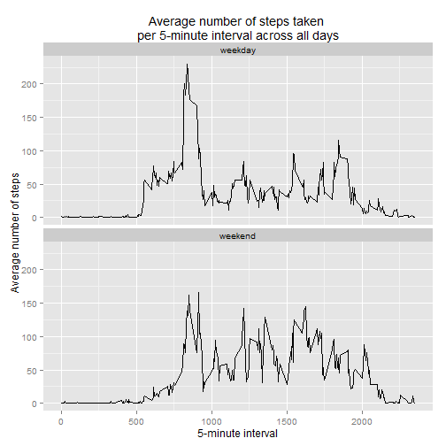

# Preliminaries

In this section I load the ggplot2 and the dplyr packages. The first is used for
constructing the graphics and the second is used for data processing.


```r
library(ggplot2)
```

```
## Warning: package 'ggplot2' was built under R version 3.2.1
```

```r
library(dplyr)
```

```
## 
## Attaching package: 'dplyr'
## 
## The following object is masked from 'package:stats':
## 
##     filter
## 
## The following objects are masked from 'package:base':
## 
##     intersect, setdiff, setequal, union
```

Additionally, the working directory has to be set:


```r
wdpath <- paste0("D:\\Reproducible Research\\",
                 "assignment 1\\repdata_data_activity")

setwd(wdpath)
```

#   Loading and preprocessing the data

The data is read from the working directory and the character variable "date"
is converted into a R date variable: 


```r
data <- read.csv(file = "activity.csv")

data$date <- as.Date(data$date, "%Y-%m-%d")
```

# What is mean total number of steps taken per day?  


#### Make a histogram of the total number of steps taken each day!


```r
hist_a <-   na.omit(data) %>%
            group_by(date) %>%
            summarise(total=sum(steps)) %>%
            ggplot(aes(date, total)) +
            geom_bar(position = "dodge", stat="identity", 
                     fill="grey70") +
            xlab("Date") +
            ylab("Number of steps") +
            ggtitle("Total number of steps taken each day")
hist_a
```

 

#### Calculate and report the mean and median total number of steps taken per day!


```r
mm_a <-     na.omit(data) %>%
            group_by(date) %>%
            summarise(total_steps=sum(steps)) %>%
            ungroup() %>%
            summarise(mean_steps=mean(total_steps), 
                      med_steps=median(total_steps))

mm_a
```

```
## Source: local data frame [1 x 2]
## 
##   mean_steps med_steps
## 1   10766.19     10765
```

# What is the average daily activity pattern?

#### Make a time series plot (i.e. type="l") of the 5-minute interval (x-axis) and the average number of steps taken, averaged across all days (y-axis)!


```r
ts_plot_a <-    na.omit(data) %>%
                group_by(interval) %>%
                summarise(mean_steps=mean(steps)) %>%
                ggplot(aes(interval, mean_steps)) +
                geom_line(stat="identity") +
                xlab("5-minute interval") +
                ylab("Average number of steps") +
                ggtitle("Average number of steps taken \nper 5-minute interval across all days")
ts_plot_a
```

 

#### Which 5-minute interval, on average across all the days in the dataset, contains the maximum number of steps?


```r
max_data <-     na.omit(data) %>%
                group_by(interval) %>%
                summarise(mean_steps=mean(steps)) %>%
                mutate(max_steps=ifelse(max(mean_steps)==mean_steps,1,0))
```

The following interval contains the maximum of steps:

```r
max_data[max_data$max_steps==1,]
```

```
## Source: local data frame [1 x 3]
## 
##   interval mean_steps max_steps
## 1      835   206.1698         1
```

# Imputing missing values

Note that there are a number of days/intervals where there are missing values 
(coded as NA ). The presence of missing days may introduce bias into some 
calculations or summaries of the data.

#### Calculate and report the total number of missing values in the dataset  (i.e. the total number of rows with NAs)!


```r
sum(is.na(data$steps))
```

```
## [1] 2304
```

```r
sum(is.na(data$date))
```

```
## [1] 0
```

```r
sum(is.na(data$interval))
```

```
## [1] 0
```

#### Devise a strategy for filling in all of the missing values in the dataset. The strategy does not need to be sophisticated. For example, you could use the mean/median for that day, or the mean for that 5-minute interval, etc.!

Although it is not recommended from a methodological point of view, I replace missing values by the mean number of step for the respective 5-minute interval.


```r
na_data <-  na.omit(data) %>%
            group_by(interval) %>%
            summarise(mean_steps=mean(steps))
```

#### Create a new dataset that is equal to the original dataset but with the missing data filled in!


```r
comp_data <-    left_join(data, na_data) %>%
                mutate(steps=ifelse(is.na(steps), mean_steps, steps)) %>%
                select(-mean_steps)
```

```
## Joining by: "interval"
```

#### Make a histogram of the total number of steps taken each day and Calculate and report the mean and median total number of steps taken per day. Do these values differ from the estimates from the first part of the assignment? What is the impact of imputing missing data on the estimates of the total daily number of steps?

##### Histogram

```r
hist_b <-   group_by(comp_data, date) %>%
            summarise(total=sum(steps)) %>%
            ggplot(aes(date, total)) +
            geom_bar(position = "dodge", stat="identity", 
                     fill="grey70")
hist_b
```

 

##### Mean and median total number of steps taken per day


```r
mm_b <-   group_by(comp_data, date) %>%
          summarise(total_steps=sum(steps)) %>%
          ungroup() %>%
          summarise(mean_steps=mean(total_steps), 
                    med_steps=median(total_steps))
```

Results with missing values:


```r
mm_a
```

```
## Source: local data frame [1 x 2]
## 
##   mean_steps med_steps
## 1   10766.19     10765
```

Results with imputed values:


```r
mm_b
```

```
## Source: local data frame [1 x 2]
## 
##   mean_steps med_steps
## 1   10766.19  10766.19
```

There is no effect on the mean number of total steps. The median is slightly increased.

# Are there differences in activity patterns between weekdays and weekends?

For this part the weekdays() function may be of some help here. Use the dataset
with the filled-in missing values for this part.

#### Create a new factor variable in the dataset with two levels -- "weekday" and "weekend" indicating whether a given date is a weekday or weekend day!


```r
weekend <-      c("Samstag", "Sonntag")        

proc_data <-    mutate(comp_data, 
                       wd=factor(ifelse(weekdays(date) %in% weekend, 
                                        "weekend", "weekday")))
```
#### Make a panel plot containing a time series plot (i.e. type="l") of the 5-minute interval (x-axis) and the average number of steps taken, averaged across all weekday days or weekend days (y-axis)!


```r
ts_plot_b <-    group_by(proc_data, interval, wd) %>%
                summarise(mean_steps=mean(steps)) %>%
                ggplot(aes(interval, mean_steps)) +
                geom_line(stat="identity") +
                xlab("5-minute interval") +
                ylab("Average number of steps") +
                ggtitle("Average number of steps taken \nper 5-minute interval across all days") +
                facet_wrap( ~ wd, ncol=1)

ts_plot_b
```

 
